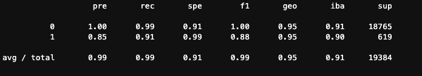
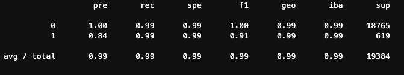

# Credit Risk Classification Report

## Overview of the Analysis

Credit risk poses a classification problem that’s inherently imbalanced. This is because healthy loans easily outnumber risky loans. In this Analysis, we are using various techniques to train and evaluate models with imbalanced classes.

---

### 1.Purpose Of Analysis

To find which technique performs well in cedit risk classification problem that’s inherently imbalanced. 

### 2.Dataset Used and Prediction Variables

 * Here we are using a dataset of historical lending activity from a peer-to-peer lending services company to build a model that can identify the creditworthiness of borrowers.
 * The Input features (X) of the data are :
      - loan_size
      - interest_rate
      - borrower_income	
      - debt_to_income	
      - num_of_accounts	
      - derogatory_marks
      - total_debt 
 * The Output label (y) is `loan_status` column
     * A value of 0 in the “loan_status” column means that the loan is healthy.
     * A value of 1 means that the loan has a high risk of defaulting.

### 3.Stages of Machine Learning Process

   1. Data Collection
    As mentioned in the previous section,  we used dataset of historical lending activity from a peer-to-peer lending sercices company.
   2. Data Preprocessing
    Here we are splititing the dataset as training set and testing set.
   3. Choosing a model
    According to our problem, we need to categorize the riskiness of the loans as “high risk” and “low risk”. We use `logistic regression` as our model.
   4. Training
    Using `logistic regression` model we fit the training data.
   5. Prediction
    We then use the trained model to predict the values for testing data.
   6. Evaluation
    We then evaluate the model's performance by doing the following:
      * Calculate the accuracy score of the model.
      * Generate a confusion matrix.
      * Generate classification report.
   7. Resampling Training Data
     We Oversample the training data because out data is Imbalanced Data(The dataset has fewer sample points for high risk loans.) Here we use `RandomOverSampler` as our resampling technique.
   8. Train, Test and Evaluate the model with Resampled data
     Our `logistic regression`  model is then trained with resampled data and is then used to predict the values for testing data. We then generate evaluation metrics for this model.
     
### 4.Methods Used

    * `train_test_split`
  Used to split the given dataset into training and testing data.
    
    * `LogisticRegression`
  `LogisticRegression`  model mathematically determines the probability of the sample belonging to a class. If the probability is greater than a certain cutoff point, the model assigns the sample to that class. If the probability is less than or equal to the cutoff point, the model assigns the sample to the other class.
    
    * `balanced_accuracy_score`
  It is an evaluation metric in binary and multiclass classification problems to deal with imbalanced datasets. It is defined as the average of recall obtained on each class.
   
    * `confusion_matrix`
  Compute confusion matrix to evaluate the accuracy of a classification

    * `classification_report_imbalanced`
  Build a classification report based on metrics used with imbalanced dataset. This report compiles the state-of-the-art metrics: precision/recall/specificity, geometric mean, and index balanced accuracy of the geometric mean.

    * `RandomOverSampler`
  To over-sample the minority class(es) by picking samples at random with replacement.

---

## Results

* Machine Learning Model 1: **Linear Regression Model with Original training data**
  * **Description:**
  In Model 1, a linear regression fit with dataset that has imbalanced class, is used to predict the label/class(`0` for healthy loans or `1` for high-risk loans) for testing  data.
  * **Accuracy:** 
  The accuracy value for Model 1 is : **0.9420647653000593(94%)**. It is given by balanced accuracy score. That is, 94% of the predicted values are correct.
  * **Precision:**
      * For label `0` (healthy loan) the `precision is 1`, which inturns means the model is very good in identifying  healthy loans. That is, all healthy loans are correctly identified as healthy loan(label `0`).
      * For label `1` (high-risk loan) the `precision is 0.87 (87%)`. That is 87 percent of the values that the model predicted as high-risk is correct.
  * **Recall:**
      * For label `0` (healthy loan) the `recall is 1`. That is, all healthy loans are correctly identified as healthy loan(label `0`).
      * The `recall is 0.89(89%)` which means of all the actual high risk loans(support value of `1` label is 684) the model rightly labelled 89% of them as high-risk.
      
    

* Machine Learning Model 2: **Linear Regression Model with Oversampled training data**
  * **Description:**
  In Model 2, a linear regression fit with oversampled training data, is used to predict the label/class(`0` for healthy loans or `1` for high-risk loans) for testing  data.
  * **Accuracy:** 
  The accuracy value for Model 1 is : **0.9944022266003689(99%)**. It is given by balanced accuracy score. That is, 99%(Almost all) of the predicted values are correct.
  * **Precision:**
      * For label `0` (healthy loan) the `precision is 1`, which inturns means the model is very good in identifying  healthy loans. That is, all the loans identified as healthy loan(label `0`) are correct.
      * For label `1` (high-risk loan) the `precision is 0.87 (87%)`. That is 87 percent of the values that the model predicted as high-risk is correct.
  * **Recall:**
      * For label `0` (healthy loan) the `recall is 0.99`. That is, almost all actual healthy loans are correctly identified as healthy loan(label `0`). It missed to identify 1% healthy loans as healthy.
      * The `recall is 0.99(99%)` which means of all the actual high risk loans(support value of `1` label is 684) the model rightly labelled 99%(almost all) of them as high-risk.

    

## Summary

* Model 2: **ç** seems to perform well with high accuracy and high precision and recall values for both classes/labels.
* To identify the creditworthiness of the borrowers, it is important to correctly identify high-risk loan(labelled as `1`) while minimizing the errors in identifying healthy loans(labelled as `0`). Credit risk possess classic problem of imbalanced class data. That is in real life less number of loans are actually high-risk. (It also depends on geography of data and economy of the location) It is important to correctly identify those fewer high risk loans(label `1`) when we come across them to minimize loss.
* Since Model 2 has high recall value for high-risk class(0.99) with precision value being the same as model 1.So `Model 2 - Linear Regression Model with Oversampled training data is recommended` compared to Model 1.
  

